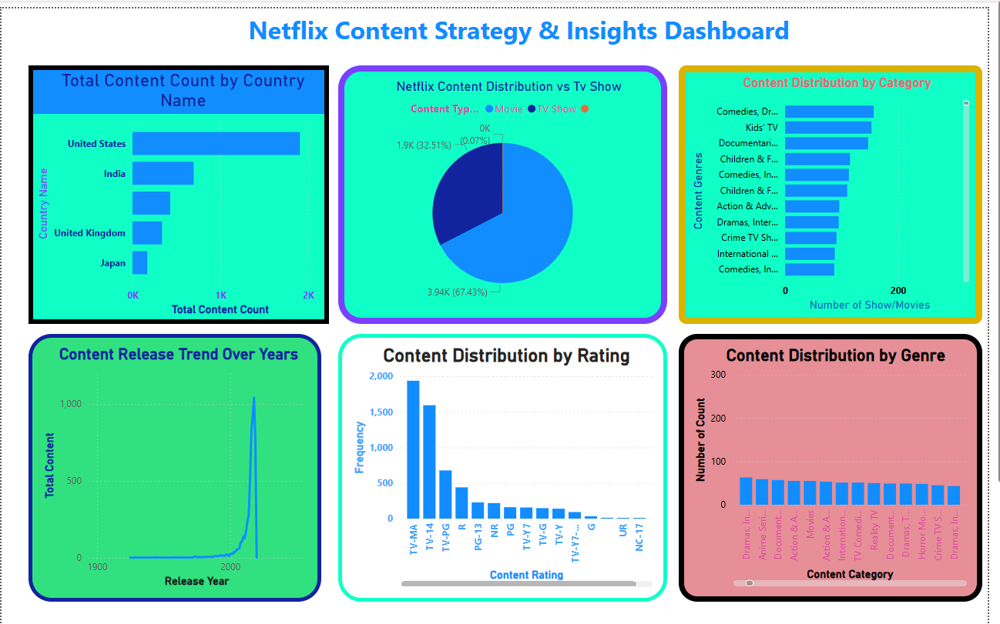

Liton Islam <litonislamnext@gmail.com>
to me

আপনার GitHub README.md ফাইলের জন্য ইমোজি এবং প্রফেশনাল ফরম্যাটসহ ইংরেজি ডেসক্রিপশনটি নিচে দেওয়া হলো। আপনি এটি সরাসরি কপি করে ব্যবহার করতে পারেন:
​📊 Netflix Content Strategy & Insights Dashboard
​📝 Project Overview

​This project provides a comprehensive data-driven analysis of Netflix's content catalog. Utilizing Power BI, the dashboard explores trends in content types, genres, audience ratings, and historical release patterns to uncover Netflix's evolving content strategy.
​🚀 Key Features

    ​Content Mix Analysis: A detailed breakdown of Movies vs. TV Shows ratio.
    ​Geographical Distribution: Insights into content production by top-performing countries.
    ​Rating Segmentation: Classification of the library based on audience age ratings.
    ​Release Timeline: Tracking the growth of content volume over the decades.

​🛠️ Tools Used

    ​Power BI: For data cleaning, modeling, and interactive visualization.
    ​DAX: Used for creating custom measures and data aggregations.
    ​Dataset: Netflix Movies and TV Shows dataset.

​🔍 Key Insights from Dashboard

    ​🎬 Content Variety: The library is dominated by Movies (67.43%) compared to TV Shows (32.51%).
    ​🌎 Global Leaders: The United States leads in content volume, followed significantly by India and the United Kingdom.
    ​📈 Exponential Growth: There is a massive surge in content additions starting from 2015, reflecting the streaming boom.
    ​🔞 Target Audience: A significant portion of the catalog is rated TV-MA, indicating a heavy focus on mature audiences.

​🖼️ Dashboard Preview

​

# Netflix-Data-Analysis-Visualization-Trend-Insights.
    Netflix Content Analysis &amp; Visualization: A data-driven exploration of Netflix's library using Python. This project analyzes trends in Movies vs. TV Shows, global content distribution, and growth over time. Key features include automated data cleaning and interactive visualizations (Matplotlib/Seaborn) to uncover strategic business insights.
